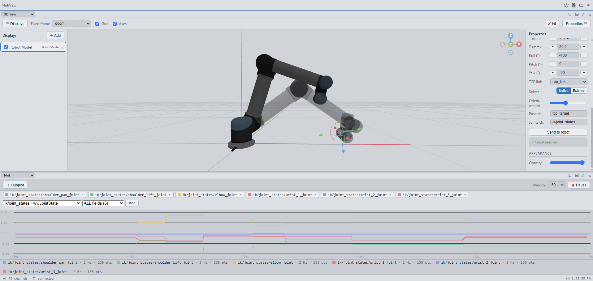
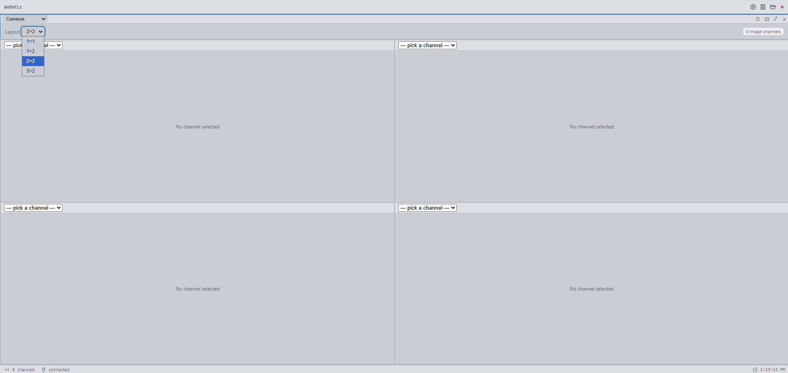
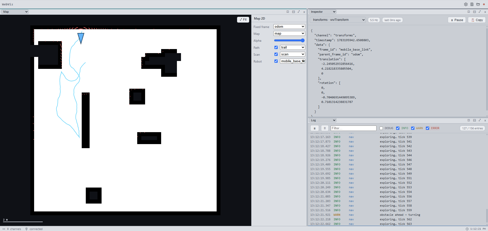

# WebViz

Browser-based visualization platform for robots and real-time systems.
**Protocol-first · Source-agnostic · Tiling-panel workspace.**

## Visualization tools

The workspace is a tiling grid of independent **panels** — split a pane to add one, close to
remove, maximize to focus (there's no tab bar; "switch between whole setups" is
[named layouts](#quick-start), not tabs). Every panel is one of six tools; within a window they
share one hub connection, one TF tree, and one clock.

**Multiple monitors?** Open the app in as many browser windows or tabs as you like — each is an
independent client of the same hub, so you can tile a few panels per window and spread them across
several displays for a wall-of-dashboards setup (drag each window to its own monitor).

Screenshots below are captured against the local stack with the bundled demos (see
[docs/screenshots/](docs/screenshots) for how to reproduce them).

### 🧊 3D



The main scene view (three.js), laid out as **Displays sidebar · viewport · Properties panel**.
You add *display plugins*, toggle them, pick the **fixed frame**, and orbit/pan/zoom the camera;
all displays anchor to the shared TF tree. The catalogue: **RobotModel** (URDF from a folder, a
GitHub URL, the bundled demo, or a `wv/RobotModel` channel — driven live by `wv/JointState`, with
**Jog mode** + drag-the-TCP IK), **TFFrames**, **Marker**, **PointCloud** (WebWorker-decoded),
**LaserScan**, **OccupancyGrid**, **Path**, **Pose**, and the interactive **CoordinateFrame**
gizmo. (Deep dive: [`packages/app/src/plugins/README.md`](packages/app/src/plugins/README.md).)

### 📈 Plot

*Pictured in the 3D screenshot above — the bottom pane traces all six joints at once via **ALL fields**.*

Live, scrolling **time-series** organized as stacked subplots — each subplot auto-scales its own
y-axis while sharing the global time window, so a small signal isn't flattened next to a large one.
Pick a channel and a numeric field (or **ALL fields** to add every field at once, e.g. all joints
of a `wv/JointState`). **Pause** freezes the time axis and lets you scroll/zoom back through the
retained history.

### 🖼️ Image



A configurable **camera grid** (1×1 up to 3×2). Each cell binds one `wv/Image` channel and blits
decoded frames to a canvas — JPEG/PNG and raw RGB8 are all supported, scaled to fit. Async decode
with frame-skipping, so a fast publisher never backs up the UI.

### 🗺️ Map



A 2D top-down (orthographic) view for navigation: a `wv/OccupancyGrid` base map, a `wv/Path`
trajectory, `wv/LaserScan` points, and a robot heading marker from a TF frame — all resolved into
the shared fixed frame. Wheel to zoom about the cursor, drag to pan, **⤢ Fit** to frame the map;
watch a map fill in SLAM-style as a robot explores.

### 🔍 Inspector

*Pictured in the Map screenshot above — the top-right pane inspects the live `transforms` messages.*

Pick any channel and watch its messages stream live as pretty-printed JSON, with the channel's
schema and update rate. The quickest way to see exactly what a source is publishing — indispensable
when wiring up a new SDK, ROS topic, or demo before you build a richer view for it.

### 📜 Log

*Pictured in the Map screenshot above — the bottom-right pane is the `map_sim_demo.py` nav log stream.*

A single, filtered, auto-scrolling **event stream** aggregating *every* `wv/Log` channel (the way
the TF tree aggregates every transform channel). Filter by level (DEBUG/INFO/WARN/ERROR) and by
free-text search on name + message; **Pause** freezes the view while logs keep buffering. Rows are
colour-coded by severity.

## Live demo

**▶ [robottool.github.io/webviz](https://robottool.github.io/webviz/)** — try it in your browser, no install.

This is a **hub-less static build** (deployed to GitHub Pages by `.github/workflows/pages.yml`
on every push to `main`), so only the fully client-side features work: open the **3D** tab,
load a URDF, and move it with **Jog mode** — joint sliders or the in-browser **IK "drag the TCP"**
gizmo. Everything that needs the hub — live channels, the Python/ROS demos, recording playback,
and saved layouts — only works when you run the full stack locally (see [Quick start](#quick-start)).

**Try it with a real robot:** in the 3D tab open RobotModel properties → *Load URDF…*, then
either click **Load demo robot**, or choose **From URL** and paste a GitHub link to a `.urdf` —
e.g. the UR5:

```
https://github.com/Gepetto/example-robot-data/blob/master/robots/ur_description/urdf/ur5_gripper.urdf
```

Leave the **meshes URL** blank — they auto-resolve from the same repo (the URDF's `package://`
refs point there). Only set it if a robot's meshes live somewhere the auto-resolver can't find
them, pointing at the folder that holds them, e.g.
`https://github.com/Gepetto/example-robot-data/tree/master/robots/ur_description/meshes/ur5/visual`.
URL loading needs a CORS-enabled host and a flat, non-`.xacro` URDF.

## What's built

All six tabs and the full 3D display-plugin catalogue are live, built on a shared `wv/*` wire
protocol, a broker hub, and Python / ROS 2 / C++ SDKs:

| Package | What works |
|---|---|
| `packages/protocol` | `wv/*` schema TypeScript types, binary frame encode/decode, JSON frame helpers, vitest tests |
| `packages/hub` | WebSocket broker (`:7777`), source/client roles, channel registry, `server_info` handshake, message fanout, layout persistence, REST + static serving (`:8080`) |
| `packages/app` | Vite + React + TS app: `HubClient` → `TimeManager` → `MessageRouter` data path, connection/tab/settings stores, split-pane workspace, named/shared layouts, session recording **capture + playback**, and six live tabs — **Inspector**, **3D**, **Image**, **Plot**, **Map**, **Log**. The 3D tab (SceneManager + TFManager + plugin system) carries the full display catalogue: `RobotModel`, `TFFrames`, `Marker`, `PointCloud`, `LaserScan`, `OccupancyGrid`, `Path`, `Pose`, `CoordinateFrame` |
| `sdks/python` | Minimal `webviz.Client` plus demos: `map_sim_demo.py` (SLAM-style Map + nav log + telemetry, one script for Map/Log/Inspector), `robot_demo.py` (UR5 that executes jog commands), `pointcloud_demo.py` (binary PointCloud), `image_demo.py` (RGB8 Image) |
| `sdks/ros2` | Drop-in `ament_python` ROS 2 adapter: auto-discovers topics whose type WebViz understands and republishes them as `wv/*` channels — no robot-code changes |
| `sdks/cpp` | Header-only, dependency-free C++ source client (own minimal RFC 6455 over raw TCP; zero-copy binary framing via `writev`) + CMake examples and a byte-layout test |

## Quick start

First-time setup on Linux — installs the toolchain (Node ≥ 22 via nvm if missing, pnpm,
JS deps, builds the protocol package) and a Python venv with `websockets` for the demos.
It's idempotent, so re-running only fills in what's missing:

```bash
./setup.sh
```

Then the fastest path is the one-shot launcher, which builds the protocol package and runs
the hub + app together (Ctrl+C tears both down):

```bash
./dev.sh        # opens http://localhost:5173 (see its header comments for VM / remote access)
```

Or run each piece by hand:

```bash
# 1. install JS deps
pnpm install

# 2. build the protocol package (consumed by hub + app)
pnpm --filter @webviz/protocol build

# 3. run the hub  (WS :7777, HTTP :8080)
pnpm hub

# 4. in another terminal, run the app dev server
pnpm app        # opens http://localhost:5173
```

Then feed it demo data (each in its own terminal):

```bash
python3 sdks/python/demos/map_sim_demo.py            # SLAM-style map + wandering robot, plus a nav log + telemetry — feeds Map / Log / Inspector (no pip deps)
venv/bin/python3 sdks/python/demos/robot_demo.py     # UR5 that executes jog "Send to robot" commands for the 3D tab (needs websockets)
venv/bin/python3 sdks/python/demos/pointcloud_demo.py # animated binary PointCloud for the 3D tab (needs websockets)
venv/bin/python3 sdks/python/demos/image_demo.py     # animated RGB8 Image for the Image tab (needs websockets)
```

Open the app, it auto-connects to `ws://localhost:7777`.

- **Inspector tab**: pick a channel and watch live messages.
- **3D tab**: add it from the `＋` menu and run `robot_demo.py` — a UR5 loads (URDF +
  meshes fetched online over CORS, no local assets) and sits at the origin as a live
  robot. It's a hub-side controller: set Joints ch. = `joint_states` and fixed frame =
  `base_link`, then enable **Jog**, drag the tool tip, and click **Send to robot** — the
  arm executes the commanded move (velocity-limited), streaming its feedback back so you
  watch it sweep there. Toggle displays, pick the fixed frame, and edit plugin settings
  in the Properties panel.
- **Other tabs**: Image (camera grid), Plot (live time-series), Map (2D top-down), and
  Log (event stream) — add any from the `＋` menu. Split the workspace into panes, save
  named layouts, and record a session to `.wvrec` (then load it back for playback).
- **Load your own URDF**: in the 3D tab's RobotModel properties, click *Load URDF…*
  and choose **Load URDF folder…** to pick the folder containing your `.urdf` + meshes.
  It validates (joints found, meshes loaded/failed). An articulated robot stays hidden
  until your pipeline publishes `wv/JointState` (so you never see a misleading all-zero
  pose) — pick that channel (and a `wv/Transform` base frame) under **Live state** to
  drive it live. To move it yourself, enable **Jog** (below).
  (To load a robot straight from a URL — with a ready-to-paste UR5 example — see
  [Live demo](#live-demo) above.)
- **Drag the robot by its tool tip (jog / IK)**: in RobotModel properties (serial arms
  only) flip on the **Jog** toggle — a translucent shadow arm appears with a gizmo on the
  tool tip while the solid robot keeps showing live state. Drag the gizmo and the shadow
  follows in real time. Two solver backends: **Native** solves in-browser with a Jacobian
  solver (no hub needed) and the drag is a preview — hit **Send to robot** to command the
  shown pose once; or **External** publishes the target as `wv/Pose` and drives the arm
  from a `wv/JointState` channel your own solver (MoveIt/KDL/ikfast/…) publishes back —
  same drag UX, your exact kinematics.
  `venv/bin/python3 sdks/python/demos/ik_solver_demo.py` is a ready-to-run external solver (and a
  template): it solves `tcp_target` → `ik/joint_states` for the demo arm.

## Build all packages

The dev flow above never needs a full build — the hub runs under `tsx watch` and the app
under Vite, so only the protocol package must be pre-built. To build every package (e.g. for
typechecking or a production bundle):

```bash
pnpm build       # pnpm -r build across protocol, hub, and app
pnpm typecheck   # typecheck the whole workspace
```

The header-only C++ SDK builds separately — see `sdks/cpp/README.md`.

## Tests

```bash
pnpm --filter @webviz/protocol test
```
